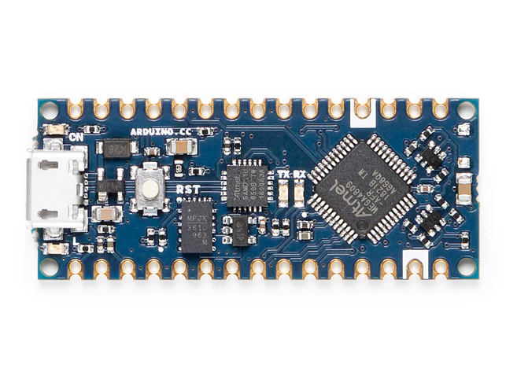
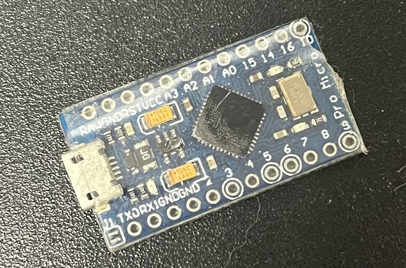

# First steps

To use this project, you need an [Arduino board](https://www.arduino.cc/en/hardware).
Realistically, any will work, but I strongly suggest getting the [Arduino Nano Every](https://store.arduino.cc/products/arduino-nano-every).

<figure markdown="span">
  
  <figcaption>The Nano Every, as shown on Arduino's store</figcaption>
</figure>

There are a few reasons I suggest this over Arduino's other offerings:

- **Pricing**: This is one of the cheapest offerings from Arduino
- **Footprint**: This is one the smallest boards
- **No Headers**: Headers are not pre-soldered to the board, further decreasing the footprint

While I strongly suggest getting the original from [Arduino's site](https://store.arduino.cc/products/arduino-nano-every) or [Amazon](https://www.amazon.com/dp/B07VX7MX27), most knock-offs will work just fine.

## Purchase

- [Official Arduino Store](https://store.arduino.cc/products/arduino-nano-every) ([Bulk option](https://store.arduino.cc/products/arduino-nano-every-pack?variant=40377141887183))
  - [Tax exemption and quotation information](https://store-usa.arduino.cc/pages/how-to-buy)
- [Arduino's Official Amazon Listing](https://www.amazon.com/dp/B07VX7MX27)
- [Other authorized Arduino distributors](https://store.arduino.cc/pages/distributors)

## Protection

!!! warning

    While not required, I suggest wrapping them in a single layer of tape, to avoid shorting during use.
    If you end up doing this, I also suggest using a clear tape, so the LEDs can shine through.

<figure markdown="span">
  
  <figcaption>One of our Arduino Nano knock-offs, with tape protecting the electronics</figcaption>
</figure>
