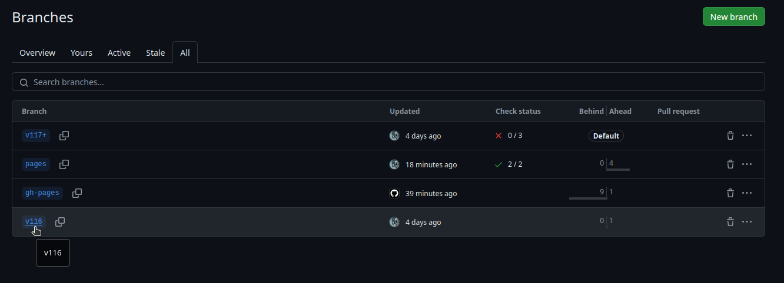
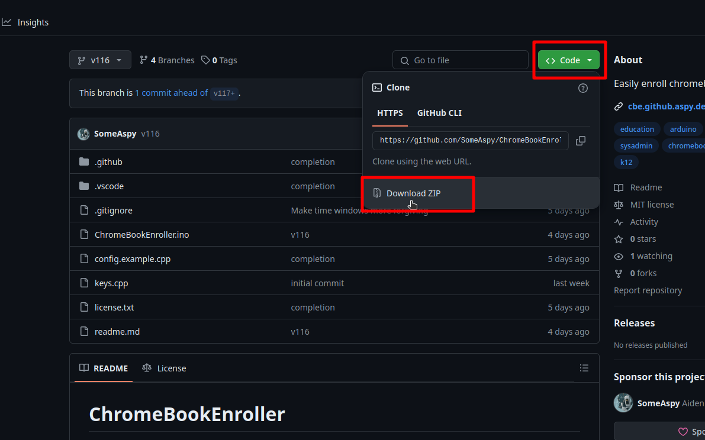

# Setup

## Installing the Arduino IDE

[Install the Arduino IDE](https://www.arduino.cc/en/software)

## Download the code

### With Git

!!! info
    If you do not know what Git is, or do not have it installed, you should skip to [Without Git](#without-git)

```bash
git clone https://github.com/SomeAspy/ChromeBookEnroller
cd ChromeBookEnroller
git branch -r
```
Switch to the branch closest to your ChromeBook's version.

---

### Without Git

1. Navigate to the list of branches in the repository:

    <https://github.com/SomeAspy/ChromeBookEnroller/branches/all>

2. Select the closest version to what your ChromeBooks are running

    <figure markdown="span">
        
        <figcaption>List of branches in the repository</figcaption>
    </figure>

3. Press the green "Code" button and select "Download ZIP"

    <figure markdown="span">
        
        <figcaption>Downloading the code ZIP</figcaption>
    </figure>

4. Download and extract the ZIP.

5. Name the folder `ChromeBookEnroller`

    !!! failure
        This step is actually crucial, as otherwise the Arduino IDE will throw an error because the project name does not match the directory name.

The file structure should look similar to this:

```txt
ChromeBookEnroller
├── ChromeBookEnroller.ino
├── config.example.cpp
├── keys.cpp
├── license.txt
└── readme.md
```
